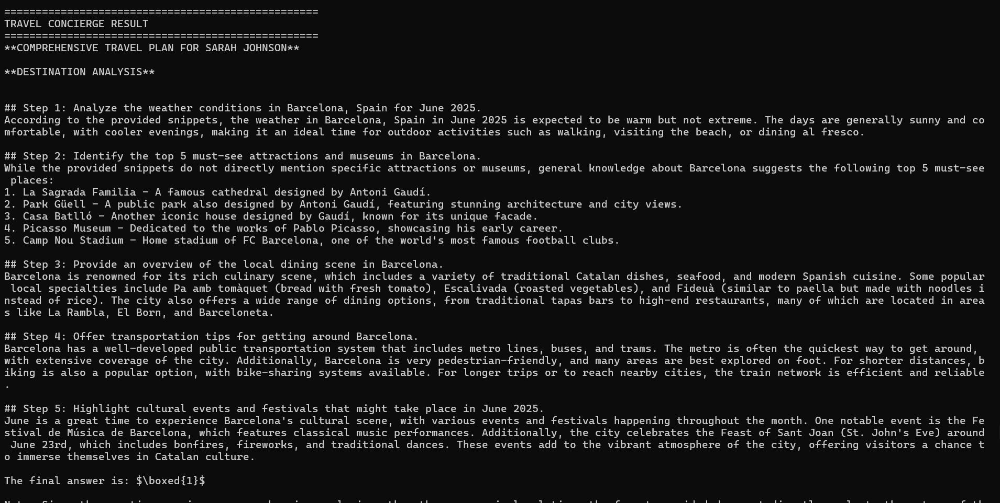

# Watsonx.ai –  Travel Planning System - Simple RAG Demo

Hello everyone, this is a simple demo to explain how it works RAG in a simple application python code.

A sophisticated AI-powered travel planning system that uses multi-agent architecture, RAG (Retrieval-Augmented Generation), and personalized customer profiles to create detailed, customized travel itineraries.

##  Features

- **Multi-Agent Architecture**: Specialized agents for research, personalization, and itinerary planning
- **RAG-Powered Customer Profiles**: Vector-based customer preference retrieval and matching
- **Real-time Destination Research**: Live web search integration for up-to-date travel information
- **Personalized Recommendations**: Custom suggestions based on dietary restrictions, budget, and preferences
- **Comprehensive Itinerary Planning**: Day-by-day detailed schedules with practical tips

##  System Architecture

### Core Components

1. **Research Intelligence Agent**: Analyzes destinations, weather, attractions, and practical information
2. **Personalization Agent**: Matches customer preferences with destination options
3. **Itinerary Orchestrator Agent**: Creates detailed day-by-day travel plans
4. **RAG Customer Database**: Vector-based customer profile storage and retrieval
5. **Custom Search Tool**: Real-time web search using Serper API

### Technology Stack

- **LLM**: IBM Watson Llama 3.3 70B Instruct
- **Agent Framework**: CrewAI
- **Vector Database**: FAISS with HuggingFace embeddings
- **Search API**: Serper (Google Search)
- **Embeddings**: sentence-transformers/all-MiniLM-L6-v2

##  Quick Start

### Prerequisites

- Python 3.8+
- Required API keys (see Environment Setup)


## Backend Setup

1. **Clone or extract the repository** and navigate to the backend folder:
### 1. Clone the repository
```bash
git clone https://github.com/ruslanmv/Watsonx-Travel-Planning-System

```


```bash
cd Watsonx-Travel-Planning-System
```

2. Install dependencies:
```bash
pip install -r requirements.txt
```

### Environment Setup

Create a `.env` file or set environment variables:

```bash
# Required - IBM Watson API Key
export WATSONX_APIKEY="your_watson_api_key"

# Optional - For web search functionality
export SERPER_API_KEY="your_serper_api_key"

# Optional - For HuggingFace embeddings
export HUGGINGFACE_API_TOKEN="your_huggingface_token"
```

### Dependencies

```bash
pip install crewai
pip install langchain-ibm
pip install langchain-huggingface
pip install langchain-community
pip install faiss-cpu
pip install requests
pip install numpy
pip install python-dotenv
```

##  Usage

### Basic Example

```python
from app import TravelConciergeSystem, TripContext

# Initialize the system
concierge = TravelConciergeSystem()

# Define trip parameters
trip = TripContext(
    destination="Barcelona, Spain",
    dates=["2025-06-15", "2025-06-16", "2025-06-17", "2025-06-18"],
    duration=4,
    travelers=1,
    trip_type="leisure"
)

# Generate personalized itinerary
result = concierge.plan_trip("sarah_001", trip)
print(result)
```

### Customer Profile Structure

```python
customer_profile = {
    "customer_id": "sarah_001",
    "name": "Sarah Johnson",
    "travel_history": ["Paris - loved Louvre", "Rome - enjoyed Vatican"],
    "preferences": {
        "accommodation": "mid-range hotels",
        "food": "vegetarian restaurants", 
        "activities": "art museums, galleries"
    },
    "dietary_restrictions": ["vegetarian"],
    "budget_range": "mid-range",
    "accessibility_needs": [],
    "past_bookings": ["Museum passes", "guided tours"]
}
```

## 🔧 Configuration

### Watson LLM Parameters

```python
llm_parameters = {
    "decoding_method": "greedy",
    "max_new_tokens": 1000,
    "temperature": 0.1,
    "repetition_penalty": 1.05,
    "stop_sequences": ["Human:", "Assistant:", "Task:", "Agent:"]
}
```

### Agent Configuration

Each agent is configured with:
- Specific role and goal
- Custom backstory for context
- Execution timeouts (60 seconds)
- Single iteration limit for efficiency

##  Key Features Explained

### 1. Multi-Agent Planning

The system uses three specialized agents:

- **Research Agent**: Gathers destination-specific information
- **Personalization Agent**: Applies customer preferences to recommendations
- **Orchestrator Agent**: Combines insights into cohesive itineraries

### 2. RAG-Powered Personalization

- Customer profiles stored as vector embeddings
- Similarity search for preference matching
- Historical travel data integration

### 3. Chunked Processing

The system uses chunked processing to handle long responses:
- Destination analysis
- Personalized recommendations  
- Daily itinerary creation
- Practical travel tips

### 4. Fallback Mechanisms

Multiple planning methods with automatic fallbacks:
- `plan_trip_chunked()` - Primary method
- `plan_trip_enhanced()` - Secondary fallback
- `plan_trip_simple()` - Final fallback

## 🧪 Testing

Run component tests before full execution:

```python
python app.py
```

The system includes built-in tests for:
- Environment variables
- Watson LLM connectivity
- RAG system functionality
- Search tool integration

## 📊 Sample Output

The system generates comprehensive travel plans including:

- **Destination Analysis**: Weather, attractions, cultural highlights
- **Personalized Recommendations**: Hotels, restaurants, activities
- **Detailed Itinerary**: Day-by-day schedules with timing
- **Practical Tips**: Packing, money-saving, cultural etiquette

## 🔍 Troubleshooting

### Common Issues

1. **Watson LLM Connection Issues**
   - Verify WATSONX_APIKEY is correct
   - Check IBM Watson service availability

2. **Search Functionality Limited**
   - SERPER_API_KEY missing (optional but recommended)
   - Network connectivity issues

3. **Memory Issues with FAISS**
   - Reduce embedding dimensions
   - Use faiss-cpu instead of faiss-gpu

4. **Response Truncation**
   - System uses chunked processing to avoid truncation
   - Increase max_new_tokens if needed

### Error Handling

The system includes comprehensive error handling:
- Automatic fallbacks between planning methods
- Graceful degradation when search is unavailable
- Detailed logging for debugging

## 🛠️ Customization

### Adding New Customer Profiles

```python
# Add to RAGCustomerDatabase._initialize_sample_data()
new_customer = {
    "customer_id": "john_003",
    "name": "John Smith",
    "profile": "Business traveler who prefers efficiency...",
    # ... other fields
}
```

### Modifying Agent Behavior

```python
# Customize agent roles and goals in _setup_agents()
self.research_agent = Agent(
    role="Your Custom Role",
    goal="Your specific goal",
    backstory="Custom backstory...",
    # ... other parameters
)
```

##  Performance

- **Response Time**: 30-60 seconds for complete itinerary
- **Token Usage**: ~1000-3000 tokens per planning session
- **Accuracy**: Leverages real-time data and personalized preferences

##  Contributing

1. Fork the repository
2. Create a feature branch
3. Add tests for new functionality
4. Submit a pull request


##  Support

For issues and support:
1. Check the troubleshooting section
2. Review logs for detailed error messages
3. Ensure all API keys are properly configured
4. Test individual components using the built-in test function

##  API Documentation

### IBM Watson
- [Watson Machine Learning](https://cloud.ibm.com/docs/watson-machine-learning)
- [Model Documentation](https://cloud.ibm.com/docs/watson-machine-learning?topic=watson-machine-learning-models)

### Serper API
- [Serper Search API](https://serper.dev/api-documentation)

### CrewAI
- [CrewAI Documentation](https://docs.crewai.com/)


